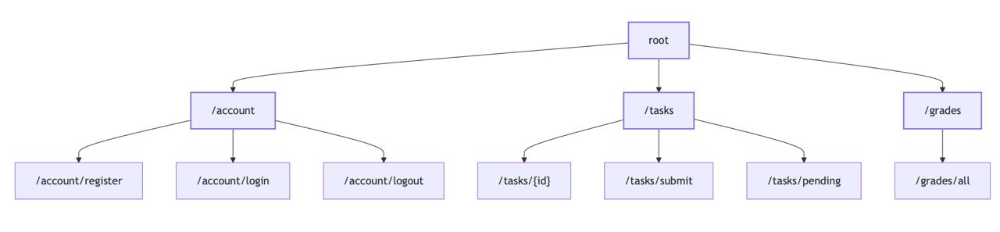
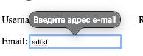

## Клиентская часть

### Регистрация
Во время регистрации добавлены проверки надежности пароля и правильности email с помощью встроенных инструментов Django
(`UserCreationForm` и `forms.email`) 

### Вход
При входе базовая проверка правильности кредов. При неправильном вводе выходит ошибка `invalid credentials`

### Список заданий
Список заданий выделен на отдельную страницу. По нажатию на каждое из них можно посмотреть детальное описание
задачи (дедлайн, штраф). Если ранее задание еще не было сдано, появляется форма для сдачи задания.  
  

### Отправка задания
При сдаче задания можно выбрать из списка актуальных. Есть проверка, чтобы уже сданные задания не были доступны
для новой отправки.

### Оценки
Оценки выделены на отдельную страницу.

### Профиль
Прописана почта пользователя, количество заданных заданий и сданных.

## Админ часть

### Выдача заданий

### Оценка заданий
При сдаче задания появляется само его название, логин ученика и дата сдачи. При открытии страницы можно оценить.

### Список учеников
Отображение всех зарегистрированных учеников. 