## Модель БД

Модель базы данных сделана на основе варианта из курса "Фронтэнд-разработка" - фитнесс зал.  
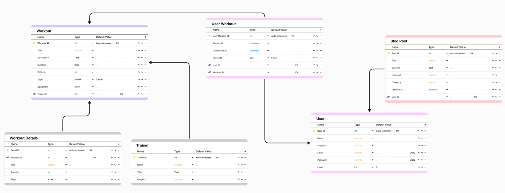

## Сущности

Главная сущность, вокруг которой работаеть весь сайт, - пользователь. Все остальные, так или иначе, с ним связаны.

## API Endpoints
### Authentication Endpoints (Djoser)
- POST /auth/token/login/ - Получить токен
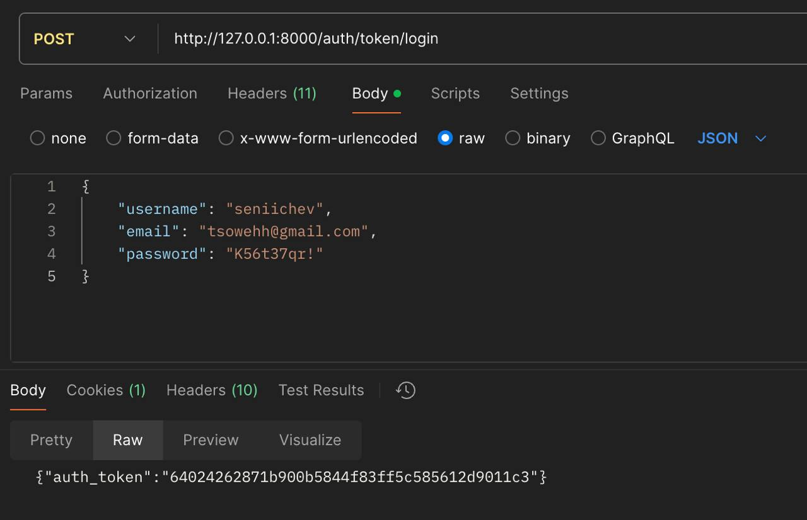
- POST /auth/users/ - Зарегистрировать пользователя
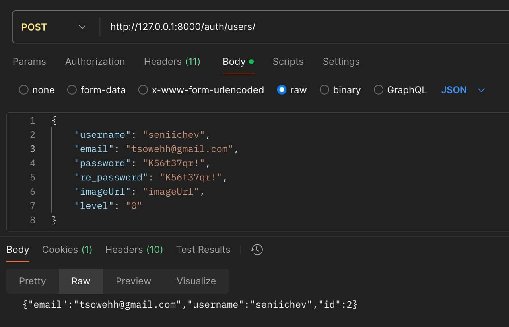
- POST /auth/token/logout/ - Выйти (удалить токен)  

### Account
- GET /account/ - Информация о пользователе
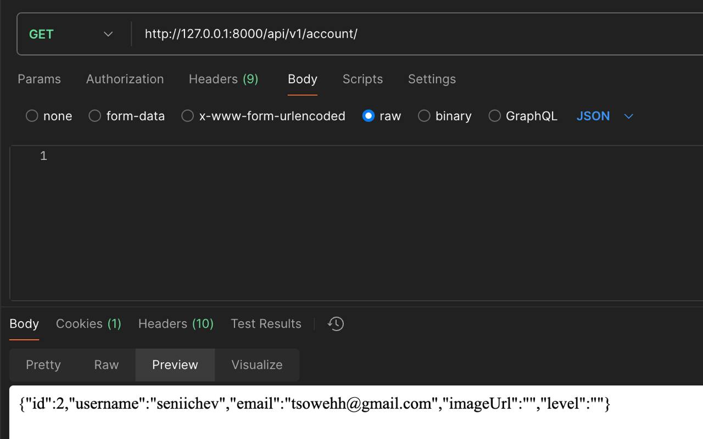
- GET /account/workots - Список тренировок, которые завершил пользователь

# Workouts
- GET /workouts/ - Список всех тренировок
    Доп. параметры:
    - trainer_id: фильтрация по тренеру
    - type: фильтрация по типу тренировки
- GET /workouts/id/ - Подробности по отдельной тренировке
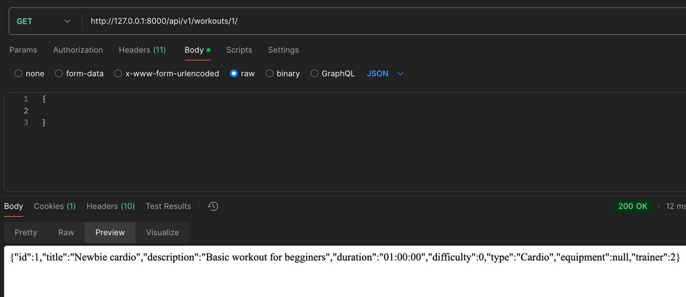
- POST /workouts/create/ - Создание тренировки
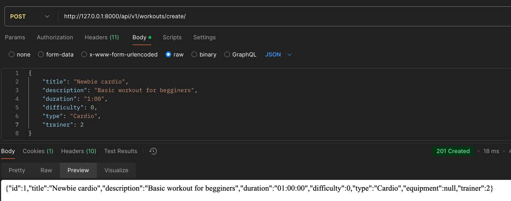

### User Workout Tracking
- POST /workouts/workout_id/start/ - Логгирование начала тренировки
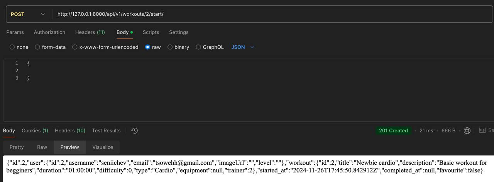
- POST /workouts/workout_id/complete/ - Логгирование окончания тренировки
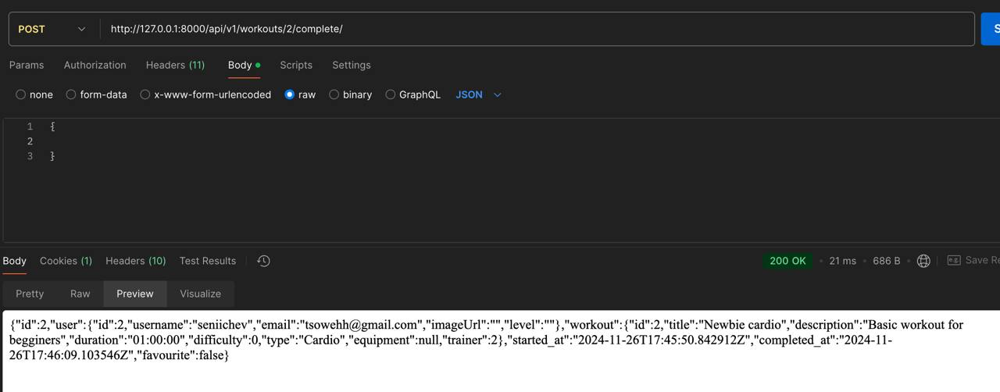

### Blogs
- GET /blogs/ - Все посты в блоге
    Доп. параметры:
    - category: фильтрация по категории
    - author_id: фильтрация по автору

- GET /blogs/id/ - Подробности по отдельному посту
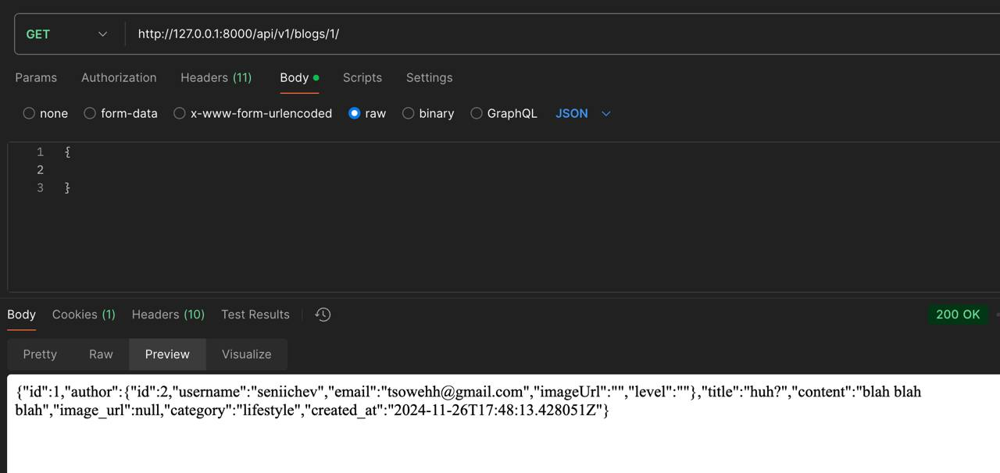
- POST /blogs/create/ - Создать новый пост
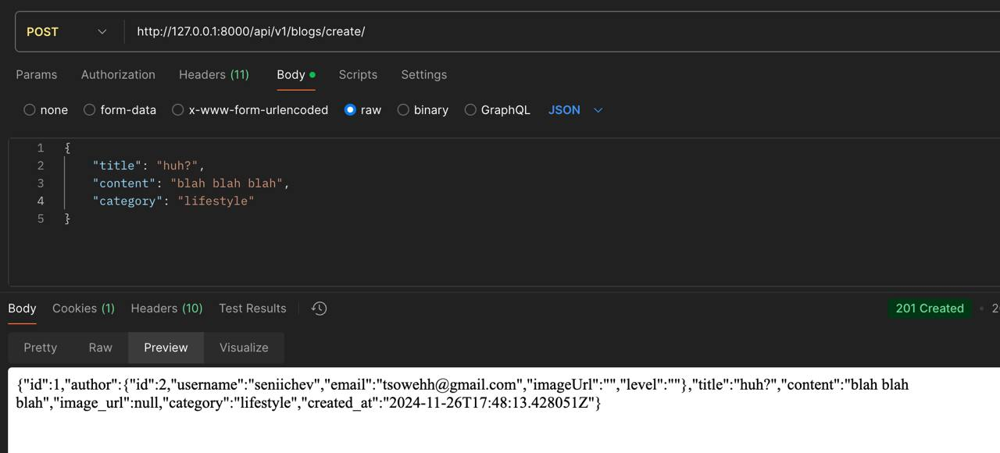
- PUT /blogs/<id>/manage/ - Обновить пост (только автор)
- DELETE /blogs/<id>/manage/ - Удалить пост (только автор)

### Trainers
- GET /trainers/ - Список всех тренеров
- GET /trainers/id/ - Подробности по отдельному тренеру
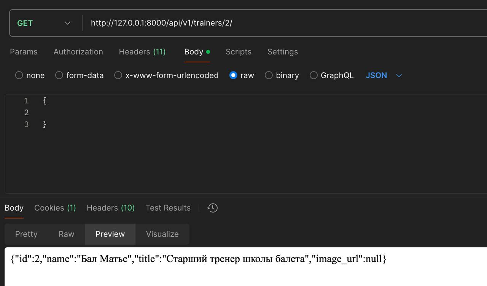
- POST /trainers/create/ - Создать профиль тренера
